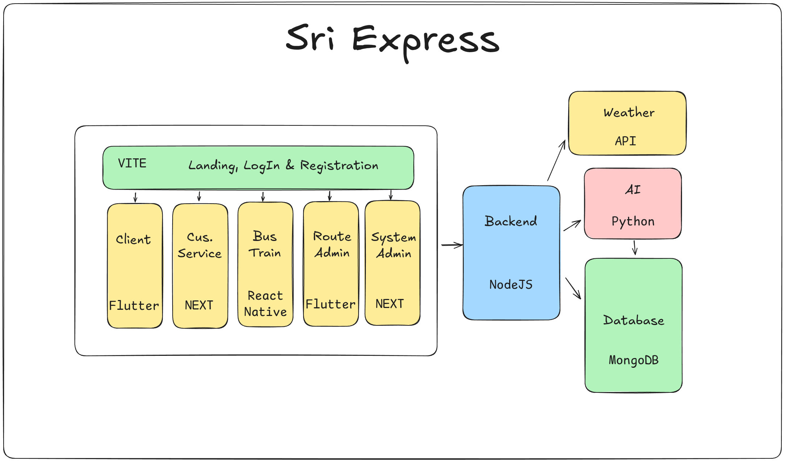

# Sri Express

Sri Express is a comprehensive transportation management platform designed to streamline client bookings, customer service, bus/train operations, and administrative tasks. The system leverages modern web and mobile technologies, AI, and robust backend services to deliver a seamless experience for users and administrators.

## Architecture

### Frontend

- **Landing, LogIn & Registration:** Built with VITE for fast and modern web experiences.
- **Client App:** Developed using Flutter for cross-platform mobile support.
- **Customer Service Portal:** Built with Next.js for efficient server-side rendering.
- **Bus/Train Operations:** Managed via a React Native application.
- **Route Admin:** Flutter-based interface for route management.
- **System Admin:** Next.js application for system-wide administration.
- **Fleet Manager:** Next.js application for fleet management of large transport companies.

### Backend

- **NodeJS:** Handles business logic, API endpoints, and integration with external services.
- **Weather API:** Provides real-time weather data to enhance route planning for passengers.
- **AI Module (Python):** Powers intelligent features such as arrival time prediction.
- **Database (MongoDB):** Stores all operational, user, and analytics data.

## Features

- Multi-role access: Clients, Customer Service, Bus/Train Operators, Route Admins, Fleet Managers, System Admins
- Real-time booking and scheduling
- AI-driven analytics and recommendations
- Secure authentication and user management

## Logo

## Getting Started

> _Project source code and setup instructions will be provided in future updates._

---

© 2025 Sri Express by XForce