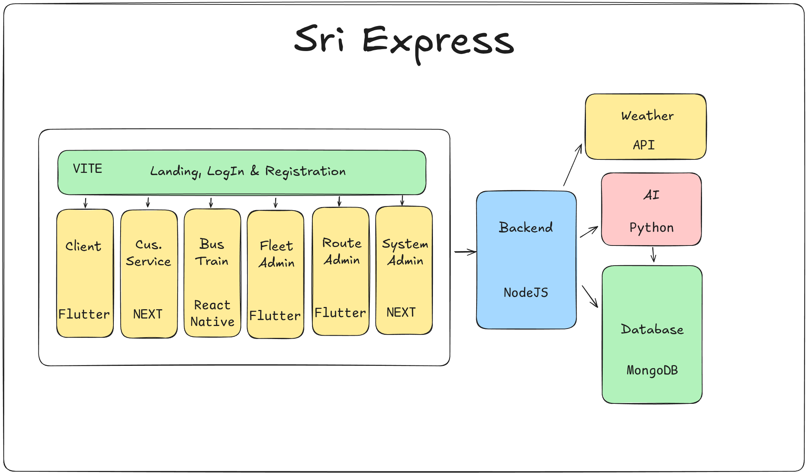

# Sri Express

Sri Express is a comprehensive transportation management platform designed to streamline client bookings, customer service, bus/train operations, and administrative tasks. The system leverages modern web and mobile technologies, AI, and robust backend services to deliver a seamless experience for users and administrators.

## Architecture

### Frontend

- **Landing, LogIn & Registration:** Built with VITE for fast and modern web experiences.
- **Client App:** Developed using Flutter for cross-platform mobile support.
- **Customer Service Portal:** Built with Next.js for efficient server-side rendering.
- **Bus/Train Operations:** Managed via a React Native application.
- **Route Admin:** Flutter-based interface for route management.
- **System Admin:** Next.js application for system-wide administration.
- **Fleet Manager:** Next.js application for fleet management of large transport companies.

### Backend

- **NodeJS:** Handles business logic, API endpoints, and integration with external services.
- **Weather API:** Provides real-time weather data to enhance route planning for passengers.
- **AI Module (Python):** Powers intelligent features such as arrival time prediction.
- **Database (MongoDB):** Stores all operational, user, and analytics data.

## Features

- Multi-role access: Clients, Customer Service, Bus/Train Operators, Route Admins, Fleet Managers, System Admins
- Real-time booking and scheduling
- AI-driven analytics and recommendations
- Secure authentication and user management

## Logo

## Details and Functionality

### Landing, LogIn & Registration
Built with VITE for fast and modern web experiences.
- The landing page provides an overview of the services offered by Sri Express, including features, pricing, and testimonials.
- The login and registration pages allow users to create accounts and access their profiles securely.

### Client App
Developed using Flutter for cross-platform mobile support.
- The client application will show estimated arrival times and provide real-time updates on bus/train schedules.
- Users can book tickets, manage their bookings, and receive notifications about their trips.
- Raise complaints and provide feedback on their experiences.
- Automated chatbot with automatically generated responses to common queries and escalation to customer service when needed.

### Customer Service Portal
Built with Next.js for efficient server-side rendering.
- The customer service portal allows support agents to manage client inquiries, complaints, and feedback.

### Bus/Train Operations
Managed via a React Native application.
- A fixed device on buses and trains will be used to track the location of the vehicle in real-time, along with other metrics such as driving patterns for AI analysis.
- A map interface will show the map of the bus or train with the current location of the vehicle and the estimated time of arrival at the next stop.

### Route Admin
Flutter-based interface for route management.
- The route admin application allows administrators to manage bus/train routes, schedules, and stops.
- Routes to be added and modified as per the requirements of the day.
- The bus/train operations to be viewed and confirmed 15 minutes before the start of the journey.

### Fleet Manager
Next.js application for fleet management of large transport companies.
- The fleet manager application allows large transport companies to add and manage their fleet of buses/trains, including maintenance schedules, driver assignments, and performance metrics pending System Admin approval.
- Fleet managers can view real-time data on vehicle locations, driving patterns, and other metrics to optimize operations.
- Revenue and cost estimates for the fleet can be generated based on the data collected from the vehicles, with the planned ticketing system.

### System Admin
Next.js application for system-wide administration.
- The system admin application allows administrators to manage user accounts, roles, and permissions.
- System admins can view analytics and reports on system usage, performance, and user feedback.
- The system admin application also provides tools for managing the AI module, including training and testing data sets.
- Activating and deactivating the AI module for the system.
- Approving or rejecting bus registration requests from the bus/train fleet managers.

## Getting Started

> _Project source code and setup instructions will be provided in future updates._

---

© 2025 Sri Express by XForce
